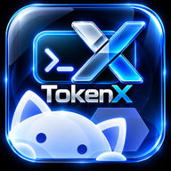
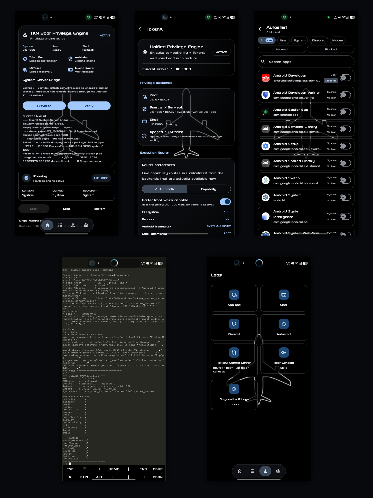

<div align="center">



# Shizuku-TokenX

### Shizuku-compatible multi-backend privilege engine for Android

**v14.1.0-TKN · Active development**

**System / UID 1000 · Root / UID 0 · Shell / UID 2000**

[](https://github.com/SysopBP/Shizuku-TokenX/actions/workflows/tokenx-debug.yml)
[](LICENSE)

</div>

> [!IMPORTANT]
> **Read the README before installing or updating Shizuku-TokenX.** Root / UID 0 requires a working root solution. System / UID 1000 uses TokenX's LSPosed `_TKN` system_server RPC and the manager-owned TokenX transport. The current System path does **not** require the legacy Serv.apk/UID-1000 package bridge.

## Shizuku-TokenX at a glance

Shizuku-TokenX combines Shizuku-compatible app authorization with multiple Android privilege backends: **System / UID 1000**, **Root / UID 0**, and **Shell / UID 2000**. The current interface includes the TokenX Control Center, execution routing, System Server Bridge verification, App Ops, Firewall, Autostart, Root Console, Shell, and Diagnostics & Logs.

### Before installing

1. Read the **Requirements** and **Installation notes** below.
2. For the System / UID 1000 backend, enable the TokenX LSPosed module for `system_server` and follow [SYSTEM_UID_INSTALL.md](SYSTEM_UID_INSTALL.md).
3. Verify the System Server Bridge after reboot before relying on UID 1000 routing.
4. Remember that UID 1000, UID 0, and UID 2000 are different Android security contexts.
5. Kiosk D2 Guardian integration is optional and only applies when D2 is installed.

## Screenshots

<div align="center">



</div>

## About TokenX

TokenX extends the Shizuku foundation into a multi-backend Android privilege engine while preserving Shizuku API compatibility for client apps.

Instead of treating System, Root, and Shell as separate authorization systems, TokenX keeps app authorization independent from the execution backend. An app can remain enabled while TokenX changes the backend used to reach Android system services.

```text
Client app
   ↓
TokenX authorization / Shizuku-compatible Binder
   ↓
TokenX Router
   ├─ System / UID 1000
   ├─ Root / UID 0
   └─ Shell / UID 2000
   ↓
Android system services
```

TokenX is a fork in the Shizuku family. The original Shizuku server, API, shell, and core architecture come from [RikkaApps/Shizuku](https://github.com/RikkaApps/Shizuku). This project also carries work from [thedjchi/Shizuku](https://github.com/thedjchi/Shizuku).

## Current architecture

### TokenX Privilege Engine

The manager coordinates the available privilege paths and reports the runtime state separately from the configured default.

- **System** — UID 1000 path provided through the TokenX LSPosed `_TKN` RPC plus the manager-owned TokenX transport.
- **Root** — UID 0 backend for rooted devices.
- **Shell** — UID 2000 Shizuku/ADB path and fallback.
- **Token Boot** — coordinates startup while Root, System and Shell remain independently discoverable; selecting one route does not replace the others.
- **Watchdog** — monitors the active engine and recovery path.
- **TokenX Router** — keeps client authorization separate from the backend currently serving it.

A package running as UID 1000 is not, by itself, proof that code is executing inside the real `system_server` process. TokenX therefore verifies bridge/runtime state instead of inferring it only from package UID.

## TokenX System Server Integration

The current System / UID 1000 framework path uses the TokenX LSPosed module and the private **_TKN Binder RPC** inside Android's real `system_server` process. TokenX verifies the returned identity directly: UID 1000, process `system_server`, and SELinux `u:r:system_server:s0`.

Root/Shizuku remains the UID 0 backend. Shell/ADB remains the UID 2000 backend/fallback. The packaged `rish_shizuku.dex` now contains the TokenX multi-backend transport client; `rish --root`, `rish --system` (or legacy `--sserver`), and `rish --shell` request UID 0, UID 1000, and UID 2000 sessions respectively. Interactive execution stays outside `system_server`.

Current integration behavior includes:

- LSPosed _TKN RPC identity verification.
- UID 1000 framework capability routing.
- D2-safe startup gating when Kiosk D2 Guardian is installed.
- Root/Shizuku lifecycle recovery and persisted app authorization.
- Safe fallback when the framework RPC is temporarily unavailable.

### D2-safe startup

On devices using Kiosk D2 Guardian, TokenX can hold the privileged companion until the D2 boot lock releases the gate. This prevents the privileged startup path from intentionally racing ahead of the lock screen.

D2 is optional. Devices without D2 use the normal bridge startup path.

## Persistent app authorization

TokenX separates **what the user authorized** from **which backend is currently running**.

When an app is enabled, TokenX persists the desired grant using the package name and Android user. When a new TokenX/Shizuku Binder is received after a server or `system_server` restart, TokenX reapplies the desired grants to the live server.

```text
Enable app
   ↓
Persist package + Android user
   ↓
Apply grant to active server
   ↓
Binder/server restarts
   ↓
TokenX receives the new Binder
   ↓
Replay persisted grants
```

A temporary backend outage is therefore not treated as an intentional revoke.

## Start methods and global routing

TokenX exposes the available launch paths instead of hiding them behind one generic state. Root, System and Shell are tracked as independent backends. A client can use the global/default route or be pinned per package to Root, System, or Shell without redefining app authorization.

| Method | Typical UID | Purpose |
| --- | ---: | --- |
| System UID | 1000 | TokenX System Server Integration |
| Root | 0 | Rooted-device backend |
| Wireless debugging | 2000 | Shizuku/ADB shell transport |
| USB debugging | 2000 | Classic ADB shell transport |

The exact operations available still depend on Android's permission and SELinux boundaries for the active backend. UID 0, UID 1000, and UID 2000 are not interchangeable security contexts.

## Systemless mounting

Legacy TokenX experiments used systemless-mounted UID-1000 packages and Meta Magic Mount RS. The current LSPosed `_TKN` System backend does not use the legacy `Serv.apk`/`com.vikram.exp` package bridge as its runtime transport. Do not install an old TokenX UID-1000 bridge solely for the current System route.

## Features inherited from Shizuku Next / thedjchi

TokenX retains the Shizuku-compatible functionality inherited through the fork it is built on, including features such as:

- Wireless debugging and pairing flows.
- Root and ADB start methods.
- Watchdog and restart handling.
- Start/stop automation intents.
- TCP mode and persistent-port tooling where supported.
- Android/Google TV support inherited from the fork.
- MediaTek fixes inherited from the fork.
- In-app shell and command tooling.
- App authorization and permission management.
- App ops, firewall, autostart, battery, and package-management tooling.
- Material 3 manager interface.
- Android 17 compatibility work.

For upstream behavior and history, see [thedjchi/Shizuku](https://github.com/thedjchi/Shizuku) and [RikkaApps/Shizuku](https://github.com/RikkaApps/Shizuku).

## Requirements

**Minimum Android version:** Android 7+

Backend-specific requirements:

- **System / UID 1000:** LSPosed with the TokenX module enabled for `system_server`; root is still required for the rooted TokenX environment and Root backend.
- **Root / UID 0:** a working root solution.
- **Wireless debugging:** Android 11+ on supported devices.
- **USB debugging:** ADB access.
- **D2-safe gate:** Kiosk D2 Guardian is optional and only affects devices where that integration is installed.

## Installation notes

This fork is signed with its own signing key. Android will not install it over another Shizuku build signed with a different key.

If migrating from official Shizuku or another fork, uninstall the conflicting package first. A server started by the previous installation may remain alive until it is stopped or the device is rebooted.

The manager keeps the Shizuku package/API compatibility expected by Shizuku client apps.

### System UID backend

The System route is formed by the TokenX manager/transport plus the TokenX LSPosed hook inside `system_server`. See [SYSTEM_UID_INSTALL.md](SYSTEM_UID_INSTALL.md) for installation and verification. The legacy standalone `Serv.apk` UID-1000 bridge is not the current runtime path.

## Diagnostics

TokenX diagnostics distinguish boot/gate sequencing, LSPosed _TKN RPC identity, Root/Shizuku lifecycle state, UID 1000 routing, and client authorization recovery.

This separation is intentional: a package can be installed correctly while the runtime Binder or privileged bridge is not healthy.

## Privacy

TokenX does not add advertising or analytics to the Shizuku foundation.

The app requires network-related permissions for Shizuku wireless-debugging functionality and update checks. Privileged operations are performed through the backend selected or available on the device.

Review the source and Android manifest before installing any privileged build.

## Building

Clone the repository with submodules:

```bash
git clone --recurse-submodules https://github.com/SysopBP/Shizuku-TokenX.git
cd Shizuku-TokenX
```

Build the manager:

```bash
./gradlew :manager:assembleDebug
```

or:

```bash
./gradlew :manager:assembleRelease
```

The debug task produces a debuggable server build suitable for development and tracing.

## Contributing

Issues, testing results, logs, and pull requests are welcome.

When reporting a backend problem, include the active method (System, Root, Wireless, or USB), Android version, device model, and the relevant TokenX/bridge diagnostics when possible.

## Credits

TokenX stands on several projects and contributions:

- **[RikkaW / RikkaApps](https://github.com/RikkaApps/Shizuku)** — original Shizuku server, API, shell, and foundation.
- **[thedjchi](https://github.com/thedjchi/Shizuku)** — the Shizuku fork this project was originally based on and the features inherited from it.
- **[@Vikramaditya015](https://github.com/Vikramaditya015)** — **System Server contribution** used in the development of TokenX's System Server work.
- **[Meta Magic Mount RS](https://github.com/Tools-cx-app/meta-magic_mount-rs)** — systemless Magic Mount layer used by the current TokenX System Server Integration setup.
- Everyone who contributed to upstream Shizuku and its forks, plus the translators and testers who continue to help validate TokenX.

## License

Unless a file states otherwise, project code remains licensed under the repository's [Apache 2.0 license](LICENSE). Third-party projects and inherited components remain subject to their respective licenses.

---

<div align="center">

**Shizuku-TokenX — one authorization layer, multiple Android privilege backends.**

</div>
